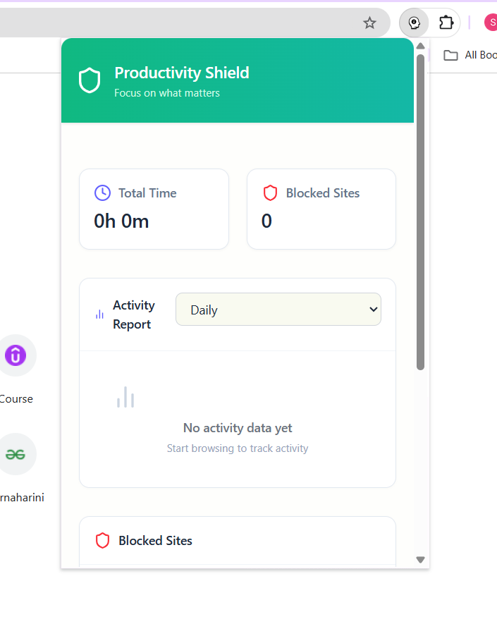
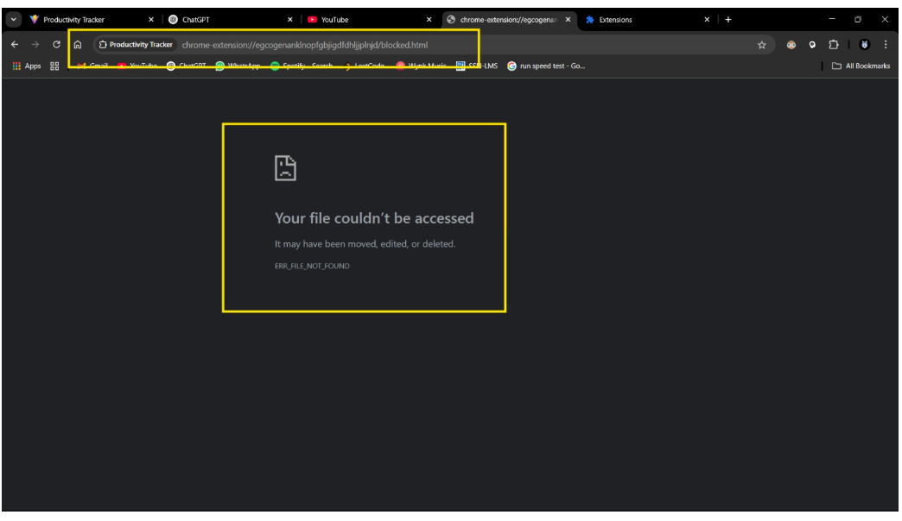

# 🚀 Productivity Tracker Chrome Extension

## 🏢 Company: CODTECH IT SOLUTIONS

- **Name**: SORNAHARINI.D  
- **Intern ID**: CT08DM1085  
- **Domain**: MERN Stack Web Development  
- **Duration**: 8 Weeks

---

## 📌 Project Title: Productivity Tracker Chrome Extension

### 🔍 Description

As part of my internship at **CodTech IT Solutions**, I developed a full-stack **Productivity Tracker Chrome Extension**, aimed at helping users monitor and manage their web browsing habits to stay focused and enhance productivity.

This extension utilizes the **MERN stack (MongoDB, Express, React, Node.js)** and integrates with **Chrome APIs** to deliver a real-time tracking and blocking solution.

---

## 🎯 Objective

To create a productivity-enhancing browser tool that:

- ⏱️ Tracks time spent on websites  
- 🚫 Allows users to block distracting domains  
- 📊 Presents usage analytics through a user-friendly dashboard  
- 🔄 Syncs data across devices using a unique Device ID  

---

## 🛠️ Technologies Used

- **Frontend**: React (Chrome Extension UI, Manifest V3 compliant)  
- **Backend**: Node.js, Express  
- **Database**: MongoDB  
- **Bundler**: Vite  
- **Browser APIs**: Chrome Extension APIs (background, storage, messaging, navigation blocking)  

---

## 🧩 Key Features

- ⏱️ Real-time time tracking for visited websites  
- 🚫 Domain blocking with customizable blocklist  
- 📊 Daily and weekly usage analytics  
- 🔁 Persistent session tracking using Device ID  
- 🔄 Background time logging via Chrome APIs  
- 🚧 Auto-redirection to “Blocked Page” for blacklisted domains  

---

## 🖼️ Output Screenshots

### 📊 Productivity Overview

### 🚫 Blocked Sites Management

---

## 🙋‍♀️ Author

- GitHub: [@Sornaharini](https://github.com/Sornaharini)
